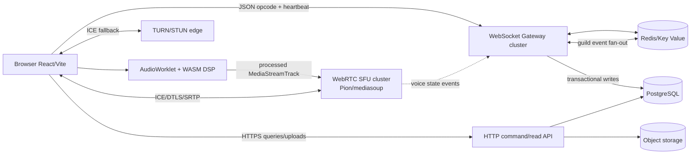

# Orbit: Browser-native Discord mimarisi

Bu doküman, `apps/client`, `apps/gateway`, `db/migrations` ve `render.yaml` içindeki referans kodun tasarım sözleşmesidir. Amaç “tek sunucuda çalışan demo” değil; bağlantı sayısı, guild boyutu, ses odası ve hata toparlanması birbirinden bağımsız ölçeklenebilen bir sistem sınırı tanımlamaktır.

## 1. Sınırlar ve ana akış



İşlem sınırları:

- **Browser:** UI, local audio capture, WASM noise suppression, speaking meter, WebRTC peer connection. Token doğrulamaz ve DB’ye doğrudan yazmaz.
- **Gateway:** kimlik doğrulama, rate limit, opcode state machine, guild/channel permission check, presence, event fan-out ve resume buffer.
- **Command API:** mesaj gönderme/düzenleme/silme, guild/channel yönetimi ve upload presigned URL işlemleri. Gateway içindeki REQUEST opcode da aynı domain command handler’larını çağırır; iki ayrı yetki sistemi yazılmaz.
- **SFU:** RTP/RTCP medya forwarding, simulcast/SVC katman seçimi ve aktif konuşmacı sinyali. Mesaj verisine erişmez.
- **PostgreSQL:** kaynak gerçeklik. Guild hiyerarşisi, üyelik, roller, kanallar, mesajlar ve audit kayıtları.
- **Redis:** kısa ömürlü state. Presence TTL, socket ownership, rate limit token bucket, Pub/Sub fan-out ve resume listeleri. Redis kaybolursa presence silinir; kalıcı mesaj kaybolmaz.

50 ms hedefi uçtan uca garanti değildir; kullanıcının son mili, TURN relay ve coğrafi mesafe belirleyicidir. SFU’nun kendi işlem bütçesi p95 < 10 ms, bölgesel yerleşim ve UDP/ICE erişilebilirliği ise tasarım hedefidir.

## 2. Ses ve medya akışı

1. Kullanıcı `getUserMedia` izni verir.
2. `AudioEngine` mono 48 kHz track’i AudioContext’e bağlar. Browser’ın `noiseSuppression`/`autoGainControl` seçenekleri kapatılır; tek DSP sahibi WASM olur.
3. `AudioWorkletProcessor`, input frame’lerini UI thread dışında WASM ABI’ye verir. `ns_process(inputPtr, outputPtr, frames, channels)` çıkışını `MediaStreamAudioDestinationNode` içine yollar.
4. Aynı frame üzerinde RMS ve dB hesaplanır. 20–25 Hz civarında `LEVEL` mesajı yayınlanır. React yalnızca bu düşük frekanslı ölçümü dinler; PCM frame’i React’e taşınmaz.
5. Çıktı track’i `RTCPeerConnection.addTrack` ile SFU’ya gönderilir. Browser ile SFU arasında signaling WebSocket opcode 9 üzerinden taşınır; SDP/ICE payload’ları domain event değildir.
6. SFU odayı SSRC/RID bazında yönlendirir. Uzak sesler tek bir `MediaStream` olarak AudioEngine remote bus’a bağlanır. Deafen, remote bus gain’ini 0’a indirir; mute, uplink gain’ini 0’a indirir.

WASM modülü `apps/client/src/audio/noise-suppression-worklet.ts` içindeki ABI’yi uygulamalıdır. Rust tarafı için önerilen sözleşme:

```rust
#[no_mangle] pub extern "C" fn ns_init(sample_rate: u32) { /* model */ }
#[no_mangle] pub extern "C" fn malloc(bytes: usize) -> *mut f32 { /* arena */ }
#[no_mangle] pub extern "C" fn ns_process(input: *const f32, output: *mut f32, frames: usize, channels: usize) { /* RNNoise/SpeexDSP */ }
```

Model binary’si immutable CDN asset olarak hash’lenir. WASM yüklenene kadar worklet passthrough yapar; yükleme hatasında uygulama mikrofonu sessizce kesmez, UI’da “DSP unavailable” durumu gösterilmelidir.

SFU signaling sırası:

```text
Client -> Gateway: VOICE_SIGNAL { type: join, channel_id }
Gateway -> Media control: membership + CONNECT/SPEAK authorization
Media -> Gateway: VOICE_SERVER_UPDATE { endpoint, token, ice_servers }
Client -> SFU: offer (opus send + recv transceivers)
Client <-> SFU: trickle ICE candidates
Client <-> SFU: DTLS/SRTP media
SFU -> Gateway: VOICE_STATE_UPDATE / active speaker
```

Render üzerinde gateway/API/DB/Redis çalıştırılabilir. Public UDP, TURN ve yüksek paket oranlı SFU için UDP destekleyen ayrı bir edge/VM/container platformu seçilmeli; SFU’yu sırf Blueprint’e eklemek medya yolunun erişilebilir olduğu anlamına gelmez.

## 3. PostgreSQL modeli

Tam migration: [`db/migrations/001_initial.sql`](../db/migrations/001_initial.sql).

```text
users
 ├─ guilds.owner_id
 ├─ guild_members (guild_id, user_id)
 │   └─ member_roles ─ roles
 └─ messages.author_id
guilds
 ├─ channels (parent_id -> category channel)
 │   └─ channel_permission_overwrites -> role/user
 └─ audit_log
messages
 └─ message_reactions
```

Mesajlar `created_at DESC, id DESC` cursor’ı ile okunur; offset pagination kullanılmaz. `client_nonce` aynı mesajın reconnect sonrası iki kez yazılmasını önleyen idempotency anahtarıdır. Silme hard-delete yerine `status = deleted` ve `deleted_at` ile yapılır; audit/abuse incelemesi korunur.

Migration, `app` şemasını browser Data API’ye kapalı ve RLS açık bırakır. Gateway için ayrı, minimum yetkili DB role oluşturulmalı; Supabase `service_role` anahtarı browser’a verilmemelidir. Eğer doğrudan Supabase Data API açılacaksa her tablo için gerçek üyelik/ownership policy’leri ve explicit grants eklenmeden tablo expose edilmemelidir.

## 4. RBAC ve channel override

İzinler `bigint` ile hesaplanır, çünkü JavaScript `number` 53 bitten sonra güvenli değildir. JSON wire formatı decimal string’dir: `"1152921504606846976"`.

[`packages/contracts/src/permissions.ts`](../packages/contracts/src/permissions.ts) şu sırayı uygular:

1. Guild sahibi `ALL_PERMISSIONS` alır.
2. `@everyone` rolü + üyenin rolleri OR’lanır.
3. `ADMINISTRATOR` varsa tüm izinler açılır.
4. Kanalın `@everyone` override’ı uygulanır.
5. Üyenin rollerine ait deny’ler birlikte, sonra allow’lar birlikte uygulanır.
6. Kullanıcıya özel override son uygulanır.

Permission check her mutasyonun başında yapılır; UI’daki disabled state bir güvenlik sınırı değildir. Role hiyerarşisi ayrıca `position` ile kontrol edilir: aktör, hedef rolün üzerinde değilse rolü değiştiremez.

## 5. Gateway protokolü

Her frame:

```json
{ "op": 5, "s": 42, "t": "MESSAGE_CREATE", "r": "request-id", "d": { "event_id": "uuid", "data": {} } }
```

Opcode’lar:

| Opcode | Yön | Amaç |
|---:|---|---|
| 0 HELLO | server → client | heartbeat interval ve protocol version |
| 1 HEARTBEAT | client → server | liveness + client sequence |
| 2 HEARTBEAT_ACK | server → client | server time ve echo sequence |
| 3 IDENTIFY | client → server | access token + device id |
| 4 RESUME | client → server | session id + son alınan sequence |
| 5 DISPATCH | server → client | sıralı domain event |
| 6 REQUEST | client → server | command/query, `r` correlation id |
| 7 RESPONSE | server → client | request sonucu |
| 8 CLOSE | iki yön | close reason/code |
| 9 VOICE_SIGNAL | iki yön | SDP/ICE ve voice control |
| 10 RECONNECT | server → client | yeni socket ve RESUME çağrısı |
| 11 HEAVY_HEARTBEAT | client → server | opsiyonel audio/network telemetri |

Önemli olaylar: `READY`, `MESSAGE_CREATE`, `MESSAGE_UPDATE`, `MESSAGE_DELETE`, `MESSAGE_REACTION_ADD`, `TYPING_START`, `PRESENCE_UPDATE`, `VOICE_STATE_UPDATE`, `VOICE_SERVER_UPDATE`.

`apps/gateway/src/server.ts` örneği:

- maksimum frame boyutunu sınırlar;
- identify olmadan command/voice kabul etmez;
- heartbeat timeout uygular;
- Redis resume listesinde son 200 dispatch’i TTL ile saklar;
- Redis Pub/Sub ile instance’lar arası guild fan-out yapar;
- devam edemeyen resume için `4006` verir, istemci yeni identify/READY akışına düşer.

Üretimde local process memory kullanılmamalıdır. Bu iskelette aktif socket registry instance-local, resume buffer Redis-backed’dır. Daha büyük kurulumda Redis Streams veya NATS JetStream ile event sequence, consumer lag ve replay sınırı açıkça yönetilmelidir.

## 6. Mesajlaşma komutları

Örnek REQUEST:

```json
{
  "op": 6,
  "r": "cmd-uuid",
  "d": {
    "name": "MESSAGE_CREATE",
    "channel_id": "channel-uuid",
    "client_nonce": "uuid",
    "content": "Merhaba"
  }
}
```

Domain transaction sırası:

```text
BEGIN
  SELECT channel + membership + effective permissions FOR SHARE
  INSERT messages ... ON CONFLICT (channel_id, author_id, client_nonce) DO NOTHING
  INSERT audit row when moderation-sensitive
COMMIT
publish gateway:dispatch { guild_id, event, data }
```

Publish commit’ten sonra yapılmalıdır. Güvenilir event teslimi gerekiyorsa `outbox_events` tablosu ve worker eklenir; Redis Pub/Sub tek başına durable değildir. Client optimistic UI kaydını `client_nonce` ile tutar ve aynı nonce’lu server event’te reconcile eder.

Typing event’i DB’ye yazılmaz; gateway’de user/channel bazında 3 saniyelik throttle ile Redis Pub/Sub üzerinden geçici gönderilir. Presence `SETEX presence:{guild}:{user}` ile tutulur; disconnect temizliği TTL ile garanti edilir.

## 7. Ölçekleme ve güvenilirlik

- Gateway instance’ları stateless deploy edilir; load balancer WebSocket upgrade ve uzun bağlantı timeout’larını desteklemelidir.
- Guild event fan-out için shard key `guild_id`; çok büyük guild’ler ayrı hot-guild shard’ına alınır.
- PostgreSQL bağlantısı worker başına limitli pool + PgBouncer ile korunur. Mesaj listeleri covering index ve cursor pagination kullanır.
- Redis Pub/Sub presence ve live fan-out içindir; kritik event/outbox için Redis Streams/NATS kullanılır.
- SFU oda kapasitesi CPU değil, çoğunlukla outbound RTP bitrate ve subscriber sayısıyla ölçülür. Oda taşınca region-aware room placement veya active-speaker/subscription policy gerekir.
- Backpressure: socket başına outbound queue byte limiti, yavaş istemci için `RECONNECT`, event coalescing (`PRESENCE_UPDATE`) ve uploadları ayrı object storage akışına ayırma.
- Gözlemlenebilirlik: `gateway_connections`, heartbeat RTT p50/p95, resume success rate, Redis lag, DB pool wait, message commit latency, SFU packet loss/jitter/NACK/PLI ve TURN allocation oranı.
- Güvenlik: TLS/WSS, Origin allowlist, token expiry + rotation, refresh token yalnızca HttpOnly/SameSite cookie, per-user/IP/guild rate limit, content length/URL sanitization, abuse audit log ve secret’ları browser bundle’a koymama.

## 8. Render ve Supabase yerleşimi

[`render.yaml`](../render.yaml) frontend static site, gateway web service, Postgres ve Key Value bağlantılarını tanımlar. `sync: false` değerleri deploy sırasında Dashboard’dan doldurulacak secret’lardır. Blueprint deploy edilmeden önce lockfile commit edilmeli ve `render blueprints validate` çalıştırılmalıdır.

Supabase kullanılırsa iki güvenli model vardır:

1. **Gateway-owned Postgres:** Supabase yalnızca managed Postgres/Auth olarak kullanılır; browser Data API kapalı, gateway server-side DB role ile konuşur.
2. **Direct Data API:** Yalnızca düşük riskli read modelleri için; public schema’daki her tablo RLS + explicit grant + üyelik policy’si ile korunur. Mesaj yazma ve RBAC mutation’ları gateway’de kalır.

## 9. Üretime geçiş checklist’i

- [ ] Gerçek OIDC/Supabase JWT signature, issuer, audience ve session revocation doğrulaması
- [ ] Gateway DB role ve migration runner ayrımı; production’da root DB credentials kullanılmaması
- [ ] `outbox_events` + retry/dead-letter worker
- [ ] Redis ACL/TLS ve private network; Key Value IP allowlist daraltması
- [ ] TURN credential rotation, SFU UDP ingress ve region health check
- [ ] WASM binary hash/SRI, model lisansı ve browser fallback UX
- [ ] WebSocket load test, reconnect storm testi, packet-loss testi ve permission property testleri
- [ ] Render Blueprint validation, lockfile, secret injection ve rollback runbook
- [ ] Data retention, GDPR deletion/export, moderation audit ve abuse response prosedürü
